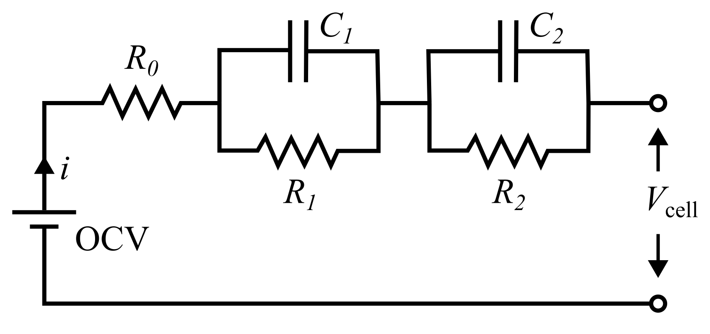

<picture>
    <source media="(prefers-color-scheme: dark)" srcset="./images/dark.svg"
    style="width: 75%; min-width: 250px; max-width: 500px;"/>
    
</picture>

</br>

[![CI][ci-b]][ci-l] ![tests][test-b] ![coverage][cov-b] [![pep8][pep-b]][pep-l]

[ci-b]: https://github.com/c-randall/thevenin/actions/workflows/ci.yaml/badge.svg
[ci-l]: https://github.com/c-randall/thevenin/actions/workflows/ci.yaml

[test-b]: ./images/tests.svg
[cov-b]: ./images/coverage.svg

[pep-b]: https://img.shields.io/badge/code%20style-pep8-orange.svg
[pep-l]: https://www.python.org/dev/peps/pep-0008

## Summary
This package is a wrapper for the well-known Thevenin equivalent circuit model. The model is comprised of a single series reistor followed by any number of parallel RC pairs. Figure 1 below illustrates a circuit with 2 RC paris; however, the model can be run with as few as zero, and as many as $N$.

<figure style="text-align: center">
    
    <figcaption>Figure 1: 2RC Thevenin circuit.</figcaption>
</figure>

This system is governed by the evolution of the state of charge (soc, $-$), RC overpotentials ($V_j$, V), cell voltage ($V_{\rm cell}$, V), and temperature ($T_{\rm cell}$, K). soc and $V_j$ evolve in time as
$$
\begin{align}
    &\frac{d\rm soc}{dt} = \frac{-I}{3600Q}, \\
    &\frac{dV_j}{dt} = -\frac{V_j}{R_jC_j} + \frac{I}{C_j},
\end{align}
$$
where $I$ is the load current (A), $Q$ is the cell capacity (Ah), and $R_j$ and $C_j$ are the resistance (Ohm) and capacitance (F) of each RC pair $j$. Note that the sign convention for $I$ is chosen such that positive $I$ discharges the battery (reduces soc) and negative $I$ charges the battery (increases soc). This convention is consistent with common higher-fidelty models, e.g., the single particle model or pseudo-2D model. While it's not explicitly included in the equations above, $R_j$ and $C_j$ are functions of soc and $T_{\rm cell}$. The temperature increases while the cell is active according to
$$
\begin{equation}
    mC_p\frac{dT_{\rm cell}}{dt} = \dot{Q}_{\rm gen} + \dot{Q}_{\rm conv},
\end{equation}
$$
where $m$ is mass (kg), $C_p$ is specific heat capacity (J/kg/K), $\dot{Q}_{\rm gen}$ is the heat generation (W), and $\dot{Q}_{\rm conv}$ is the convective heat loss (W). Heat generation and convection are defined by
$$
\begin{align}
    &\dot{Q}_{\rm gen} = I \times (V_{\rm ocv}({\rm soc}) - V_{\rm cell}), \\
    &\dot{Q}_{\rm conv} = hA(T_{\infty} - T_{\rm cell}),
\end{align}
$$
where $h$ is the convecitive heat transfer coefficient (W/m$^2$/K), $A$ is heat loss area (m$^2$), and $T_{\infty}$ is the air/room temperature (K). $V_{\rm ocv}$ is the open circuit voltage (V) and is a function of soc.

Finally, the overall cell voltage is
$$
\begin{equation}
    V_{\rm cell} = V_{\rm ocv}({\rm soc}) - \sum_j V_j - IR_0,
\end{equation}
$$
where $R_0$ the lone series resistance (Ohm), as shown in Figure 1. Just like the other resistive elements, $R_0$ is a function of soc and $T_{\rm cell}$.

## Installation
We recommend using [Anaconda](https://anaconda.com) to install this package due to the [scikits.odes](https://scikits-odes.readthedocs.io) dependency, which is installed separately using ``conda install`` to avoid having to download and install C++ and Fortran compilers.

After cloning the repository, or downloading the files, use your terminal (MacOS/Linux) or Anaconda Prompt (Windows) to navigate into the folder with the `pyproject.toml` file. Once in the correct folder, execute the following commands:

```cmd
conda create -n rovi python=3.10 scikits.odes -c conda-forge
conda activate rovi
pip install .
```

The first command will create a new Python environment named `rovi`. The environment will be set up using Python 3.10 and will install the `scikits.odes` dependency from the `conda-forge` channel. You can change the environment name as desired and specify any Python version >= 3.8 and < 3.12. Although the package supports multiple Python versions, development and testing is primarily done using 3.10. Therefore, if you have issues with another version, you should revert to using 3.10.

Before running the `pip install` command, which installs `thevenin`, you should activate your new `rovi` environment using the second command. If you plan to make changes to your local package, use the `-e` flag, and add the optional developer dependencies during the `pip install` step.

```cmd
pip install -e .[dev]
```

## Getting Started
The API is organized around three main classes that allow you to construct the model, define an experiment, and interact with the solution. A basic example for a constant-current discharge is given below. To see the documentation for any of the classes or their methods, use Python's built in `help()` function.

```python
import thevenin

model = thevenin.Model()

exp = thevenin.Experiment()
exp.add_step('current_A', 15., (3600., 1.), limit=('voltage_V', 3.))

sol = model.run(experiment)
sol.plot('capacity_Ah', 'voltage_V')
```

## Contributions
Contributions are welcomed and encouraged. If you choose to contribute, please note that this package mostly follows the [PEP8 style guide](https://www.python.org/dev/peps/pep-0008) style guide. However, we allow adding extra spaces around parentheses and brackets, and under- or over-indenting multi-line expressions when it improves readability or avoids the 80-character line limit.

Be aware that it is the authors' preference to not adopt the more opinionated [black formatting style](https://black.readthedocs.io/en/stable/the_black_code_style/current_style.html) formatting style. Please avoid autoformatting any files in this style if you plan to contribute.

## Acknowledgements
This work was authored by the National Renewable Energy Laboratory (NREL), operated by Alliance for Sustainable Energy, LLC, for the U.S. Department of Energy (DOE). The views expressed in the repository do not necessarily represent the views of the DOE or the U.S. Government.